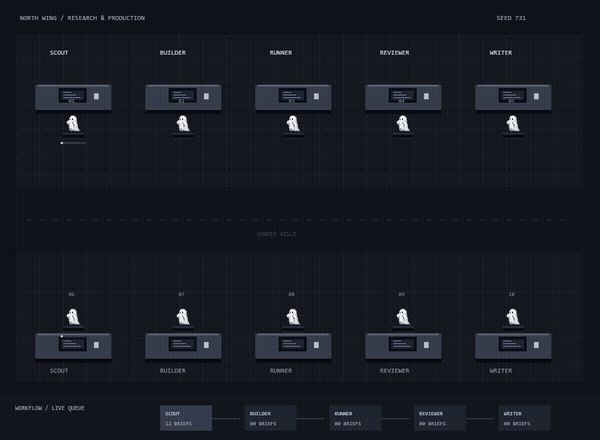

<p align="center"><sub>L / LABS — EXPERIMENT 002</sub></p>
<h1 align="center">Ghost Office</h1>
<p align="center">Small ghosts. Actual handoffs.</p>



**A tiny office where the workflow is visible.** Ten workers, five roles and a shared inbox. Every brief moves through research, building, execution, review and writing. The workers use Lagerskoy's original pixel-ghost mascot, not a redesigned character.

> Workers are **scripted state machines**, not live LLM agents. All queue counts, handoffs and shipped totals come from the same local task state. No API calls, accounts or telemetry.

## Run it

1. **Code → Download ZIP**, then extract it.
2. Open **index.html** in your browser; keep the other files beside it.
3. Select a seed and 1–50 briefs, then click **New workday**.

For video recording, serve the folder locally:

```sh
python -m http.server 8000
```

Open [localhost:8000](http://localhost:8000). A local server avoids browser restrictions on capturing canvases with local image files.

## One brief, five stages

```text
SCOUT → BUILDER → RUNNER → REVIEWER → WRITER → SHIPPED
```

There are two workers for each role. Each brief has exactly one owner while being worked on or carried. After work finishes, its owner walks through the central aisle to the next role's desk, hands it off, and returns home. The next available worker in that role claims the queued brief. Desks are role inboxes, so an available same-role colleague may pick up a delivered task.

The room, progress bars, workflow strip, role queues and office chat are views of that same event stream. Every shipped brief produces exactly four handoffs. The office stops when the batch is complete.

## Controls & exports

- **Seed** changes the reproducible work durations.
- **Briefs** sets the batch size.
- **Pause / Resume** and **1× / 2× / 4×** control playback.
- **Export workday JSON** saves the configuration, task states, history and events. Restore a configuration manually with the controls; JSON import is not implemented.
- **Record 15s WebM** records the next 15 seconds of the canvas in supported browsers, without audio. Keep the tab active. Chrome/Edge with a local server is the intended path.
- Reduced-motion preference starts the office paused.

## Preview

The GIF and [MP4 demo](demo.mp4) use the actual canvas renderer at **3× simulation speed**. [preview.png](preview.png) is a still; [example-run.json](example-run.json) is a seed-731 snapshot after 60 simulation seconds, which may be an unfinished workday.

## Tests

```sh
node test.cjs
```

Tests run complete batches of 1, 2, 12, 25 and 50 briefs. They check deterministic replays, one owner per task, five-stage completion, four handoffs per shipped task and continuous movement (no teleporting).

## Architecture & limits

`engine.js` has no DOM dependencies and is usable from Node. `app.js` draws the room and binds controls. `mascot.jpg` is the original source image, drawn with pixel-preserving scaling. `style.css` and `index.html` form the responsive shell.

This first public version demonstrates task routing, not language-model quality, real employee productivity or a production scheduler. Workers follow shared aisle paths; they can pass through one another and do not simulate crowd collisions. Task stages always succeed; retries and real provider integration are not implemented.

---

[Agent Arena](https://github.com/Lagerskoy/agent-arena) · [Terminal Lab](https://github.com/Lagerskoy/terminal-lab) · [@lagerskoy](https://x.com/lagerskoy)
